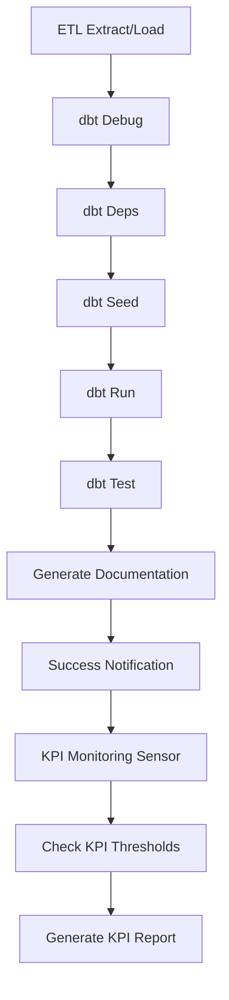

# SIGETI Data Warehouse - Airflow Automation

This directory contains the Apache Airflow setup for automating the SIGETI ETL pipeline and KPI monitoring.

## 🏗️ Architecture

The automation consists of two main DAGs:

1. **`sigeti_etl_pipeline`** - Main ETL pipeline (Daily at 6:00 AM)
2. **`sigeti_kpi_monitoring`** - KPI monitoring and alerts (Daily at 8:00 AM)

## 📋 Prerequisites

- Python 3.8+
- PostgreSQL (sigeti_node_db and sigeti_dwh databases)
- Working ETL script (`etl_sigeti.py`)
- dbt project configured (`dbt_sigeti/`)

## 🚀 Quick Start

### 1. Install Airflow and Dependencies

```bash
cd c:\Users\hynco\Desktop\SIGETI_DWH\airflow
pip install -r requirements.txt
```

### 2. Initialize Airflow

```bash
python setup_airflow.py
```

This script will:
- Install Apache Airflow
- Initialize the database
- Create admin user (admin/admin123)
- Generate startup scripts

### 3. Start Airflow Services

**Option A: Using batch files (Windows)**
```bash
# Start scheduler (in one terminal)
start_scheduler.bat

# Start webserver (in another terminal)
start_webserver.bat
```

**Option B: Manual start**
```bash
# Set environment
set AIRFLOW_HOME=c:\Users\hynco\Desktop\SIGETI_DWH\airflow

# Start scheduler
airflow scheduler

# Start webserver (new terminal)
airflow webserver --port 8080
```

### 4. Access Airflow UI

1. Open browser: http://localhost:8080
2. Login: admin / admin123
3. Enable DAGs:
   - `sigeti_etl_pipeline`
   - `sigeti_kpi_monitoring`

## 📊 DAGs Overview

### Main ETL Pipeline (`sigeti_etl_pipeline`)

**Schedule**: Daily at 6:00 AM
**Tasks**:
1. `set_environment_variables` - Configure environment
2. `etl_extract_load` - Run Python ETL script
3. `dbt_debug` - Check dbt connections
4. `dbt_deps` - Install dbt packages
5. `dbt_seed` - Load reference data
6. `dbt_run` - Transform staging to marts
7. `dbt_test` - Run data quality tests
8. `generate_kpi_report` - Generate dbt documentation
9. `success_notification` - Send success notification

### KPI Monitoring (`sigeti_kpi_monitoring`)

**Schedule**: Daily at 8:00 AM (after ETL)
**Tasks**:
1. `wait_for_etl_completion` - Wait for main pipeline
2. `check_kpi_thresholds` - Validate KPI ranges
3. `generate_kpi_report` - Create monitoring report

**KPI Thresholds**:
- Acceptance Rate: 30% - 80%
- Average Processing Time: 5 - 15 days
- Total Demands: 1 - 1000
- Pending Demands: 0 - 50

## 🔧 Configuration

### Database Connections

Edit the connection parameters in DAG files if needed:

```python
DB_CONFIG = {
    'host': 'localhost',
    'database': 'sigeti_dwh',
    'user': 'postgres',
    'password': 'postgres',
    'port': 5432
}
```

### Schedule Changes

To modify schedules, edit the `schedule_interval` in DAG definitions:

```python
# Daily at different time
schedule_interval='0 10 * * *'  # 10:00 AM

# Weekly on Mondays
schedule_interval='0 6 * * 1'   # Monday 6:00 AM

# Hourly
schedule_interval='@hourly'
```

## 📁 Directory Structure

```
airflow/
├── dags/                          # DAG definitions
│   ├── sigeti_etl_pipeline.py     # Main ETL DAG
│   └── sigeti_kpi_monitoring.py   # KPI monitoring DAG
├── logs/                          # Airflow logs
│   └── kpi_report_YYYYMMDD.txt   # Daily KPI reports
├── plugins/                       # Custom plugins (if any)
├── airflow.cfg                    # Airflow configuration
├── airflow.db                     # SQLite metadata database
├── requirements.txt               # Python dependencies
├── setup_airflow.py              # Setup script
├── start_scheduler.bat           # Windows scheduler startup
└── start_webserver.bat          # Windows webserver startup
```

## 🔍 Monitoring and Troubleshooting

### View Logs

1. **Airflow UI**: Go to DAG → Task → Logs
2. **File System**: Check `logs/` directory
3. **KPI Reports**: Daily reports in `logs/kpi_report_YYYYMMDD.txt`

### Common Issues

**1. DAG not appearing**
- Check DAG file syntax: `python -m py_compile dags/sigeti_etl_pipeline.py`
- Verify `dags_folder` in `airflow.cfg`
- Refresh DAGs in UI

**2. Task failures**
- Check database connections
- Verify file paths in tasks
- Review Python/dbt environment setup

**3. Permission issues**
- Ensure Airflow has read/write access to directories
- Check database user permissions

### Manual Task Execution

```bash
# Test single task
airflow tasks test sigeti_etl_pipeline etl_extract_load 2024-01-01

# Run entire DAG
airflow dags backfill sigeti_etl_pipeline -s 2024-01-01 -e 2024-01-01
```

## 🔄 Pipeline Dependencies



## 📧 Notifications

### Email Configuration

Edit `airflow.cfg` to configure SMTP:

```ini
[smtp]
smtp_host = your-smtp-server.com
smtp_starttls = True
smtp_ssl = False
smtp_port = 587
smtp_user = your-email@company.com
smtp_password = your-password
smtp_mail_from = airflow@company.com
```

### Alert Thresholds

Modify thresholds in `sigeti_kpi_monitoring.py`:

```python
kpi_checks = {
    'acceptance_rate': {
        'min_threshold': 25.0,  # Adjust as needed
        'max_threshold': 85.0,
    },
    # ... other KPIs
}
```

## 🛠️ Development

### Adding New Tasks

1. Edit DAG file
2. Add new task operator
3. Define dependencies
4. Test with `airflow tasks test`

### Custom Operators

Create custom operators in `plugins/` directory for reusable logic.

### Environment Variables

Set in DAG or `airflow.cfg`:

```python
os.environ['SIGETI_DWH_PATH'] = r'c:\Users\hynco\Desktop\SIGETI_DWH'
os.environ['DBT_PROFILES_DIR'] = r'c:\Users\hynco\Desktop\SIGETI_DWH\dbt_sigeti'
```

## 🎯 Next Steps

1. **Configure email notifications** for alerts
2. **Set up monitoring dashboards** (Grafana/PowerBI)
3. **Add data quality tests** in dbt
4. **Implement retry policies** for critical tasks
5. **Schedule backup jobs** for the data warehouse

## 📞 Support

For issues or questions:
1. Check Airflow logs in UI
2. Review task execution details
3. Validate database connections
4. Test individual components manually